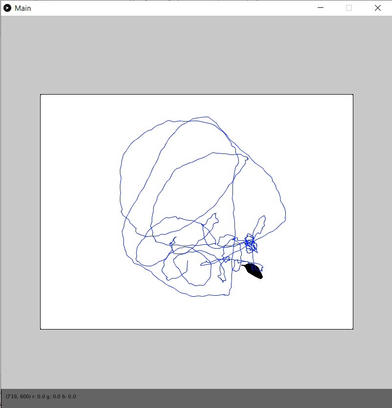

# Animal Tracker
The MouseTracker video filter processes a bird’s-eye view video of an animal inside an enclosure. It uses a combination of a box blur convolution matrix and an increasing threshold to detect the animal.

The position of the center of the animal is then stored in a DataSet object that also returns important information about the animal such as average speed, maximum speed, total time and time intervals spent in regions of interest, speed at certain times, and total distance traveled.

MouseFilter also writes the positions of the animal to a csv file.

Framework to load the video created by David Dobervich NOT included

Main2 reads a csv file that contains an animal’s positions and loads the data into a DataSet object. The DataSet API can then be used to tell the user about the animal’s average speed, maximum speed, total time and time intervals spent in regions of interest, and total distance traveled.
